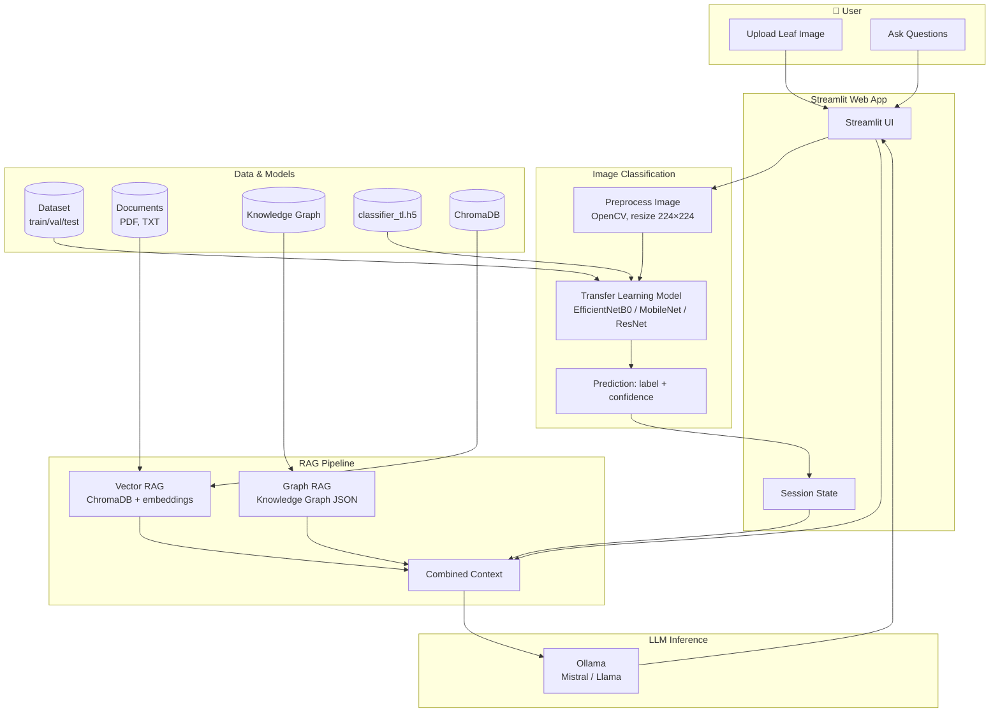
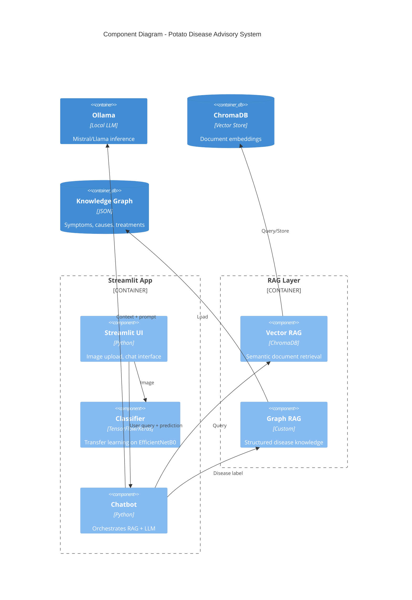
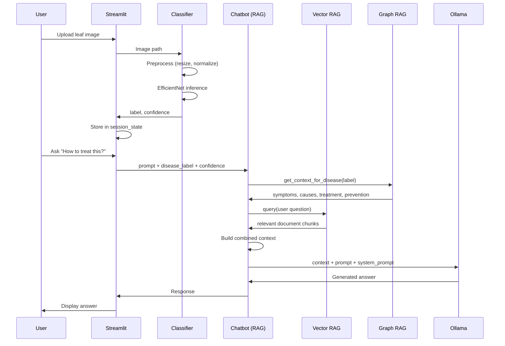

# Potato Leaf Disease Detection & Advisory System — Architecture

## High-Level Flow

```
┌─────────────┐     ┌──────────────────┐     ┌─────────────────┐     ┌──────────────┐
│   User      │────▶│  Streamlit App    │────▶│   Classifier     │────▶│  Prediction  │
│  (browser)  │     │  (Web UI)         │     │  (EfficientNet)  │     │  + Chat      │
└─────────────┘     └──────────────────┘     └─────────────────┘     └──────────────┘
                            │                         │
                            │                         │ label + confidence
                            ▼                         ▼
                    ┌───────────────────────────────────────────────────────┐
                    │              Disease Advisory Chatbot                  │
                    │  ┌─────────────┐  ┌─────────────┐  ┌───────────────┐  │
                    │  │ Vector RAG  │  │ Graph RAG   │  │ Ollama (LLM)  │  │
                    │  │ (ChromaDB)  │  │ (JSON KG)   │  │ (Mistral)     │  │
                    │  └─────────────┘  └─────────────┘  └───────────────┘  │
                    └───────────────────────────────────────────────────────┘
```

## Mermaid Diagram



## Component Diagram (Simplified)



## Data Flow (Sequence)



## File Structure (Modules)

```
src/
├── app.py              # Streamlit entry point
├── config.py           # Paths, hyperparameters, class names
├── classifier/
│   ├── model.py        # Transfer learning model (EfficientNet, etc.)
│   ├── predict.py      # Inference API
│   ├── train_classifier.py   # Train classifier
│   ├── evaluate_classifier.py
│   └── plot_confusion_matrix_demo.py
├── rag/
│   ├── vector_rag.py   # ChromaDB-based retrieval
│   ├── graph_rag.py    # Knowledge graph retrieval
│   ├── ingest_documents.py
│   └── visualize_graph.py   # Render knowledge graph as PNG (requires networkx)
└── chatbot/
    ├── chatbot.py      # Hybrid RAG + Ollama orchestration
    └── ollama_client.py # HTTP client for Ollama API
```

### Data & Model Paths

- `dataset/train/`, `val/`, `test/` — Real images by class
- `model/classifier_tl.h5` — Trained classifier
- `data/knowledge_graph.json` — Graph RAG nodes & edges
